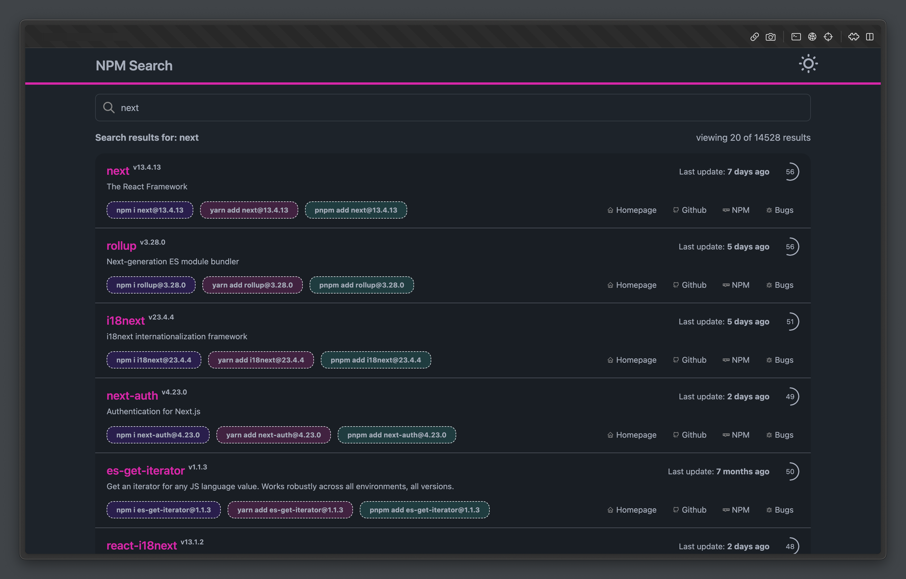

# NPM Search



The NPM Search is a user-friendly interface that allows users to search for packages available on the [Node Package Manager (NPM)](https://www.npmjs.com/) registry. This application provides a seamless experience for developers to discover, explore, and learn about various NPM packages that can enhance their projects.

## Features and Todo's

- [x] **Quick and Efficient Search**: The application offers a powerful search functionality that enables users to quickly find NPM packages by name, keywords, or descriptions.

- [x] **Package Details**: Users can view detailed information about a specific package, including its name, version, description, author, license, and more.

- [x] **Interactive UI**: The user interface is designed to be intuitive and responsive, providing a smooth experience across different devices and screen sizes.

- [ ] **Sorting and Filtering**: Users can sort search results based on relevance, popularity, or date. Filtering options allow users to narrow down results by scope, keywords, and more.

- [ ] **Package Statistics**: Gain insights into package popularity, weekly downloads, and GitHub repository stars to help users make informed decisions.

## Installation and Usage

1. Clone this repository to your local machine.
   ```
   git clone https://github.com/xqsit94/npm-search.git
   ```

2. Navigate to the project directory.
   ```
   cd npm-search
   ```

3. Install the required dependencies.
   ```
   yarn install
   ```

4. Start the development server.
   ```
   yarn dev
   ```

5. Access the application by opening your browser and navigating to `http://localhost:5173`.

## Contributing

Contributions are welcome! To contribute to the NPM Search Web Application, follow these steps:

1. Fork the repository.

2. Create a new branch for your feature or bug fix.
   ```
   git checkout -b feature/new-feature
   ```

3. Make your changes, commit them, and push to your fork.

4. Submit a pull request detailing your changes and their purpose.

## License

This project is licensed under the [MIT License](LICENSE).
